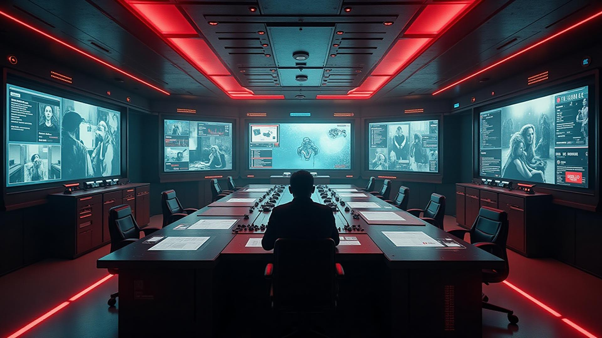
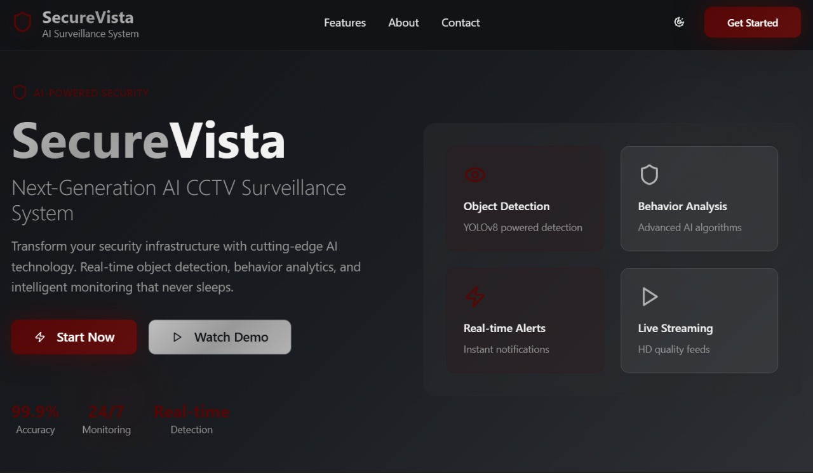
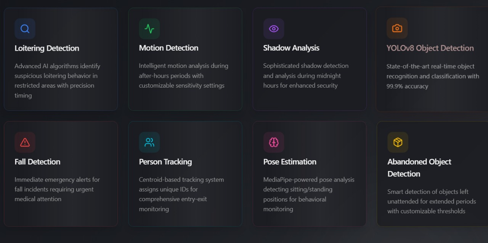
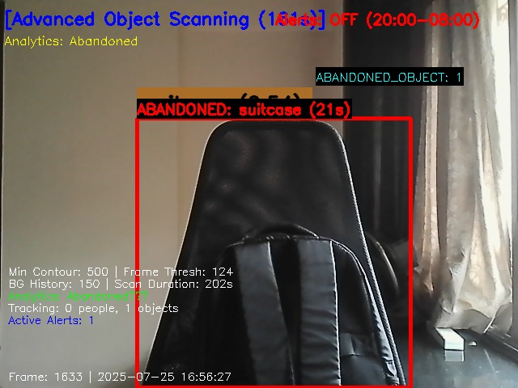

  <h1>🔐 SecureVista 🔐</h1>
  <h3><em>Redefining campus safety through smart, AI-powered surveillance.</em></h3>

<!-- Terminal Intro Animation -->

  

## 🎯 Problem & Inspiration

<table>
<tr>
<td>

Traditional CCTV systems are reactive and unreliable under human supervision. 94% of institutions have surveillance systems, but human operators miss up to 95% of incidents within 20 minutes due to fatigue.

**SecureVista** transforms passive cameras into smart, proactive guardians that monitor, analyze, and alert in real time — making campuses safer and smarter.

</td>
<td width="40%">

</td>
</tr>
</table>

## 🧠 What It Does

  <table>
    <tr>
      <td align="center"><h3>🔍</h3><h4>Real-Time Alerts</h4>
Instant anomaly notifications
</td>
      <td align="center"><h3>🚶</h3><h4>Loitering Detection</h4>
Flags prolonged presence in restricted zones
</td>
    </tr>
    <tr>
      <td align="center"><h3>🤕</h3><h4>Fall Detection</h4>
Triggers emergency alerts on falls
</td>
      <td align="center"><h3>🎯</h3><h4>YOLOv8 Detection</h4>
Identifies objects and activities in real-time
</td>
    </tr>
    <tr>
      <td align="center"><h3>📦</h3><h4>Abandoned Object Monitoring</h4>
Detects unattended objects in public spaces
</td>
      <td align="center"><h3>🧍‍♂️🪑</h3><h4>Pose Estimation</h4>
Exam posture detection to prevent cheating
</td>
    </tr>
    <tr>
      <td align="center"><h3>👁️</h3><h4>Centroid Tracking</h4>
Tracks entry/exit of individuals with unique IDs
</td>
      <td align="center"><h3>📤</h3><h4>Automated Reporting</h4>
Sends real-time alerts via Twilio & PyWhatKit
</td>
    </tr>
  </table>

## ⚙️ Tech Stack

🐍 Python • 📹 OpenCV • 🧠 YOLOv8 • 🖐️ MediaPipe • 🌐 Flask / FastAPI  
💬 Twilio • 🔥 Firebase • 🐘 PostgreSQL • 📧 smtplib • 📊 NumPy • 🧵 threading

## 🎓 Target Users

- 🏫 **Schools, Colleges, Hostels** – Student safety, intrusion alerts, and exam integrity  
- 🏢 **Offices, Hospitals, Shops** – Real-time alerts, motion detection, object monitoring  
- 🏘️ **Homes & Societies** – Perimeter automation, fall detection, and elderly safety

## 🏗️ How We Built It

<table>
<tr>
<td>

SecureVista leverages AI and modern backend technologies:

- 🧵 Background AI thread pipelines
- 🌐 WebSockets for real-time data updates
- 🧠 YOLOv8 for object detection
- 🖐️ MediaPipe for pose estimation
- 📹 MOG2 for motion detection
- 🔥 Firebase for authentication
- 🐘 PostgreSQL for data storage

All modules run in microservices communicating via REST and WebSocket for lightning-fast response.

</td>
<td width="40%">

</td>
</tr>
</table>

## 🗺️ Roadmap

- ✅ Campus Security MVP complete  
- 🧪 Academic Integrity Monitoring (pose + pupil detection)  
- 🔐 Blockchain-based identity integration  
- 📈 Reach 20% lead-to-customer conversion  
- 💼 Maintain 90%+ customer retention with excellent support

## 📸 Demo Screenshots

  <table>
    <tr>
      <td></td>
      <td></td>
    </tr>
    <tr>
      <td></td>
      <td></td>
    </tr>
  </table>

## 📽️ Demo Video

  

## 📂 Project Info Deck

  

## 🧠 What We Learned

- Designing scalable real-time detection pipelines  
- Optimizing pose estimation models (MediaPipe)  
- Handling WebSocket streams & Firebase auth  
- Reducing alert fatigue with intelligent prioritization

---

## 🧩 Challenges Faced

- ⚠️ Real-time performance vs AI model complexity  
- 🔍 Avoiding false positives in object detection  
- 💾 Syncing live multi-camera feeds  
- 🧠 Managing memory-heavy ML workloads on limited hardware

## 🔗 Useful Links

  

> 🔐 *“A smarter campus isn’t just safe — it’s aware.”*

  Built with ❤️ by Team ConsoleLog

